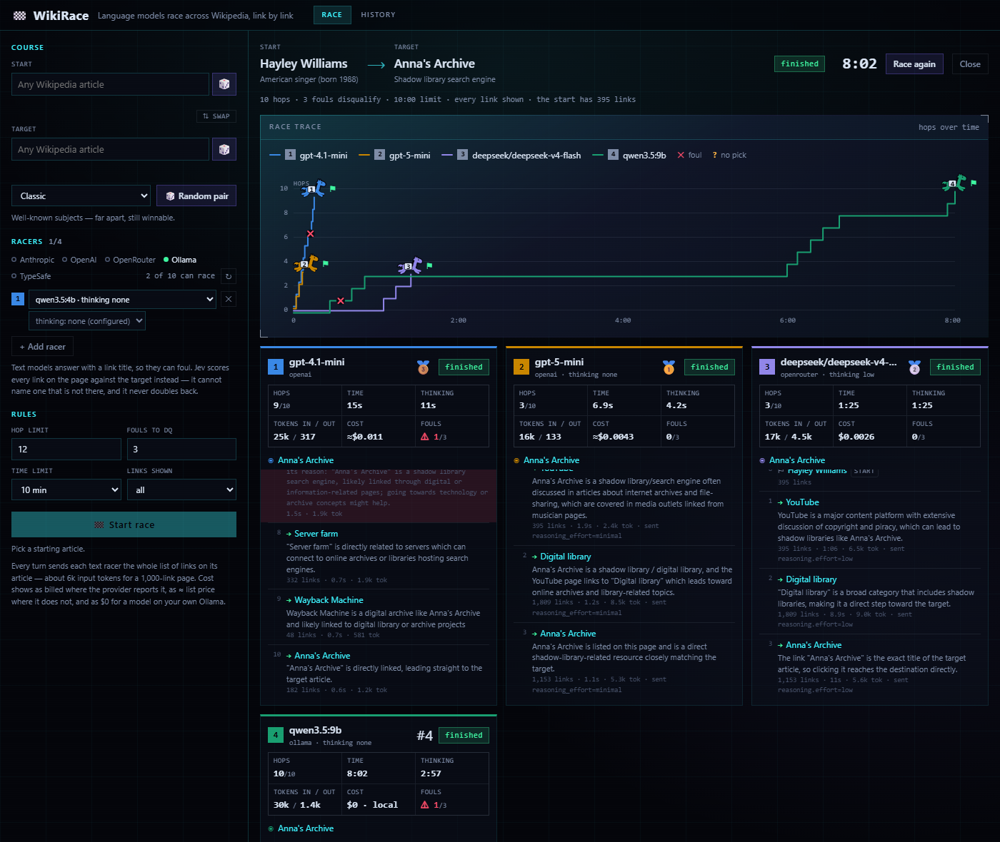
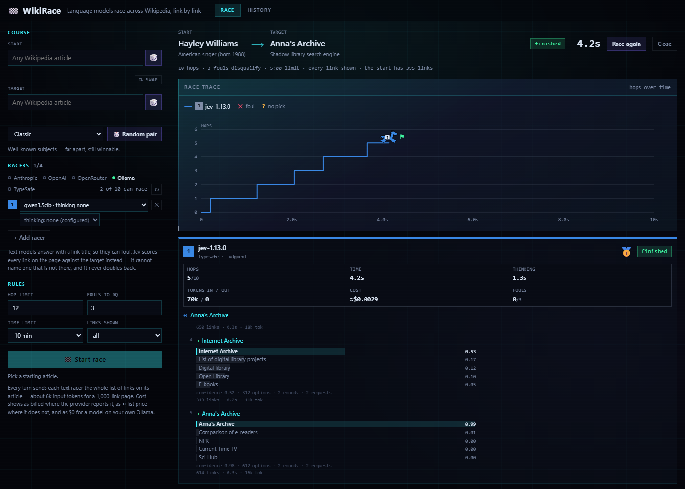

# 🕹️ JEV-Arcade

**Fifteen arcade cabinets where language models play each other live: WikiRace, and fourteen
more games that each show one thing a judgment model does well.**

JEV-Arcade opens on its arcade floor. Every cabinet plays its own attract-mode loop, an LED
ticker scrolls the latest results, and the arrow keys walk the floor. Pick a cabinet, put up to
four players in the lanes (TypeSafe's Jev, and any text model your keys reach), and watch them
play on the server: every move with its reason or its probabilities, tokens and cost, every cheat
caught, and a finale for the winner. Arcade sounds play from your first click (the speaker in the
header mutes them), and the floor remembers, in your browser only, which cabinets you have
played.

## WikiRace, the flagship

**Language models race across Wikipedia, link by link.**

Pick a start article and a target. Up to four models set off from the start and may only follow
links on the page they are on. Whoever reaches the target in the fewest hops wins. You watch it
live: every move with the model's reason, hops over time, tokens and cost, and every attempt to
cheat caught and logged.



Five providers can race on the same track:

| Provider | What races | Key |
|---|---|---|
| **Anthropic** | Claude (Haiku, Sonnet, Opus, …) | `ANTHROPIC_API_KEY` |
| **OpenAI** | GPT and the o-series | `OPENAI_API_KEY` |
| **OpenRouter** | hundreds of models behind one key | `OPENROUTER_API_KEY` |
| **Ollama** | your own local models, on this machine or your network | none: `OLLAMA_BASE_URL` |
| **TypeSafe** | **Jev**, a judgment model that scores links instead of writing | `TYPESAFE_API_KEY` |

## Jev races differently

Every other racer reads the page's links and answers in words: `REASON: …` / `LINK: …`. That is
exactly what lets it cheat: it can name a link that is not on the page, or jump straight to the
target.

[TypeSafe](https://typesafe.ai)'s Jev writes no text at all. Each turn it answers one typed
`choice` question: *which of these links should a racer on `current_article` click to reach
`target_article` in the fewest clicks?* It returns a probability for every link on the page (up
to 255 in one question; a bigger page is split and judged in two rounds), and the racer takes the
top one. So Jev **cannot foul**: every move is a real link. What the race measures is whether its
judgment finds a path, and how fast: a Jev turn is typically a fraction of a second.

Every Jev move shows its evidence: the top five links with their probabilities as bars, its
confidence, and how many options, rounds and requests the move took. It costs TypeSafe's input
rate, $0.042 per million tokens.



Both screenshots are real races run while this was built, on the same course: the four text
models above took from 6.9 s to 8 minutes, three to ten hops; Jev took five hops and 1.3 s of
thinking in all.

## The Arcade

The floor holds fourteen more cabinets beside the race, each showing a different thing a
judgment model does well. The same players take the lanes: Jev, and any text model your
keys reach. Every game runs on the server and streams live, like a race, and keeps its history.

| Game | What happens | Jev use case |
|---|---|---|
| **Legal Moves Only** | Chess puzzles, mate in one. Jev picks from the real legal moves; a text model writes a move and can write an impossible one | typed actions |
| **Switchboard** | Callers ring in on a clock; each operator patches them to one of 150 intents, or to a human when unsure, before they hang up | intent routing, confidence gating |
| **Customs** | Messages ride an X-ray belt; hazard gauges send each to pass, inspect or block | LLM guardrails |
| **WikiGuessr** | Where on Earth is this redacted article? Claim continent, country, region, only as deep as you're sure | hierarchical classification |
| **Rail Yard** | Jev throws the switches that send each prompt to the text model that should answer it, against "always the big one" | model routing |
| **Two Truths and a Lie** | A text model writes three claims about an article; Jev checks each against it, and so do you | verification |
| **Judges' Panel** | Jev scores every contestant on five rubrics once; drag the weights and the ranking changes with no new request | composite scoring |
| **Ghost Maze** | Two mazes, one clock, ten ticks a second. The ghosts don't wait for a model that's still thinking | real-time decisions |
| **Needle Hunt** | Find the line of the Constitution (or any article) that answers the question, or say it isn't there | line-by-line search |
| **Slot Machine** | One borderline post, fifteen pulls: does the verdict hold still? | self-consistency |
| **Drive-Thru** | Spoken orders in, typed function calls out, with a read-back when unsure | function calling |
| **Memory Match** | Two shops' listings: the same product, a close variant, or not? | entity alignment |
| **The Big Sort** | Hundreds of random Wikipedia articles sorted into topics while you watch | map-reduce over big data |
| **Blind Tasting** | Guess the critic's score: Jev measures the note, a small model in code does the maths | features for ML |

The rounds' material (puzzles, callers, messages, orders, products, notes) is written for
WikiRace, or read live from Wikipedia. [docs/arcade.md](docs/arcade.md) says how a game is built.

## Quick start

You need at least one provider: a key in `.env`, or an Ollama you run yourself.

### With Python

Requires Python 3.11+. With [uv](https://docs.astral.sh/uv/):

```bash
git clone https://github.com/Analytics206/wikirace.git
cd wikirace
cp env.example .env        # then add a key, or point OLLAMA_BASE_URL at your Ollama
uv run wikirace
```

Open <http://localhost:8000>. With plain pip instead:

```bash
python -m venv .venv
source .venv/bin/activate  # Windows: .venv\Scripts\activate
pip install -e .
wikirace
```

### With Docker

```bash
cp env.example .env
docker compose up -d
```

Open <http://localhost:8000>. Race history lives on the `wikirace-data` volume. The page is
published on `127.0.0.1` only; see [Security](#security).

## Settings

One file, `.env`, configures both ways of running: `wikirace` reads it from the working
directory, and `compose.yaml` hands it to the container. A variable set in your real environment
wins over the file. `env.example` documents every setting.

Each provider has a key, a model list, a thinking level and (rarely needed) a base URL:

```ini
OPENAI_API_KEY=sk-...
OPENAI_MODELS=gpt-4.1-mini, o4-mini@high
OPENAI_THINKING=low
```

- `*_MODELS` is the roster the race setup offers. `model@level` pins that model's thinking level.
  Leave it empty for the defaults. The setup can also race any other model id of a provider you
  have a key for (handy for OpenRouter's catalogue).
- **Thinking levels** are `none`, `low`, `medium`, `high`, `xhigh` and `max`. A racer's level is,
  first to last: what the race setup picks, the model's `@level`, `<PROVIDER>_THINKING`, then
  `WIKIRACE_THINKING`. With none of them set, nothing is sent and the model thinks as it does by
  default.
- Leaving `OLLAMA_MODELS` empty offers every model your Ollama has pulled.

| Variable | Default | |
|---|---|---|
| `ANTHROPIC_API_KEY` · `ANTHROPIC_MODELS` · `ANTHROPIC_THINKING` | `claude-haiku-4-5, claude-sonnet-5, claude-opus-5` | |
| `OPENAI_API_KEY` · `OPENAI_MODELS` · `OPENAI_THINKING` · `OPENAI_BASE_URL` | `gpt-4.1-mini, o4-mini` | any Chat Completions server works via the URL (one that needs no key still needs some value in `OPENAI_API_KEY`) |
| `OPENROUTER_API_KEY` · `OPENROUTER_MODELS` · `OPENROUTER_THINKING` | `deepseek/deepseek-v4-flash, minimax/minimax-m3` | |
| `OLLAMA_BASE_URL` · `OLLAMA_MODELS` · `OLLAMA_THINKING` | `http://localhost:11434`, every model it has | not bundled: your own instance; set the URL empty to switch Ollama off |
| `OLLAMA_NUM_CTX` | `16384` | context window per request, in tokens |
| `TYPESAFE_API_KEY` · `TYPESAFE_MODELS` | `jev-1.13.0` | |
| `WIKIRACE_THINKING` | unset | the level for every racer, unless something nearer says |
| `WIKIRACE_PORT` · `WIKIRACE_HOST` | `8000` · `127.0.0.1` | in Docker, the port published on your machine |
| `WIKIRACE_DB` | `data/wikirace.db` | race history (Docker: the `/data` volume) |
| `WIKIRACE_MAX_RACES` | `2` | races that may run at once |
| `WIKIRACE_ALLOWED_HOSTS` | `localhost`, `127.0.0.1` | other names or addresses the page is opened under (`wikirace.lan, 192.168.1.20`), or `*` |
| `WIKIRACE_USER_AGENT` | `wikirace/<version> (repo URL)` | what Wikipedia is told; put your own contact here |

A value WikiRace cannot use (a misspelt level, say) is ignored and shown as a warning in the race
setup, never a crash.

### How each provider is asked to think

| Provider | A level is sent as | Cost shown |
|---|---|---|
| Anthropic | `output_config.effort` on models that take it, a thinking budget on older ones; `none` turns thinking off where the model allows | list price, marked ≈ |
| OpenAI | `reasoning_effort` on reasoning models (o-series, gpt-5 and later, gpt-oss); nothing on the others | list price, marked ≈ |
| OpenRouter | `reasoning.effort` | what OpenRouter billed |
| Ollama | `think` | free, local |
| TypeSafe | not applicable | $0.042 per million input tokens, ≈ |

When a model refuses a level (not every model takes `xhigh`, say), the nearest level it accepts is
sent instead, and the move shows what was actually sent.

### Ollama

Ollama is not bundled: WikiRace assumes you run your own, on this machine or elsewhere on your
network (`OLLAMA_BASE_URL=http://192.168.1.20:11434`). In Docker, `localhost` in that URL still
means your machine: it is rewritten to `host.docker.internal` inside the container.

Big articles have thousands of links, and Ollama silently cuts a prompt that overflows the model's
context window, rules first. So WikiRace names the window on every request (`OLLAMA_NUM_CTX`), and
when a page still does not fit, the racer is shown the first links that do, in reading order, and
the move says how many.

## The rules

- A racer on an article may pick only a link on that article. Everything is checked against
  Wikipedia's own list of the page's links, never against the model's idea of them.
- **Fouls**: `off_page` (not a link here; the log says whether the article exists at all),
  `teleport` (naming the target when this page does not link to it, including by a redirect), and
  `no_pick` (the reply named no link). A foul costs a strike and the racer stays put, told why.
  Three strikes disqualify (adjustable).
- Spelling slips are not fouls: case, dashes, quotes, trailing punctuation, `[[wiki links]]` and
  URLs are forgiven. Substance is not.
- Naming the target when the page links it under another name (one of its redirects) is the winning
  move, not a foul.
- Limits: hops (default 12), time (default 10 minutes) and an optional link cap (show only the
  first N links in reading order).
- **Ranking**: fewest hops, then least thinking time. Rate limits are waited out in plain sight
  and never count as thinking time.

## How it is built

A Python server (FastAPI, httpx and the Anthropic SDK), SQLite for race history, and a browser
page with no build step (Preact and htm, vendored, so nothing is fetched from a CDN). A race runs
on the server as a background task, so closing the page does not stop it, and the page follows it
over server-sent events. [docs/design.md](docs/design.md) has the details: the API, the event
stream, how Jev is asked, and how each provider is called.

## Development

```bash
uv sync
uv run pytest            # no network: fake Wikipedia, mocked providers
uv run ruff check .
node --test tests/js     # the page's pure state (Node 22+)
```

`node tests/js/mock_server.mjs` serves the page at <http://127.0.0.1:8001> against a mocked API
that replays a recorded race live, for working on the page without any keys or network.

`uv run python tests/games/demo_server.py` serves the real app at
<http://127.0.0.1:8002> over stand-in players (a fake Jev that answers in a tenth of
a second, fake text models that take one to six), for playing the Arcade without keys.

## Security

- Keys stay on the server. The page never receives one.
- There is no login. The server binds to `127.0.0.1` by default, and Docker publishes it on
  `127.0.0.1` only. If you open it to your network, anyone who reaches it can start races on your
  API credits.
- It answers only to the host names it is given (`localhost` and `127.0.0.1` unless
  `WIKIRACE_ALLOWED_HOSTS` adds more), so a web page elsewhere cannot reach it by pointing a name of
  its own at your machine.
- A URL is never shown with a password in it, and a provider's refusal of a key is shown without
  the provider's words, which can quote the key back.
- `.env` is ignored by git; `env.example` holds no secrets.

## License

[MIT](LICENSE). The page's two libraries are vendored in `src/wikirace/static/vendor/` under their
own licenses: [Preact](https://preactjs.com) (MIT) and [htm](https://github.com/developit/htm)
(Apache-2.0).
